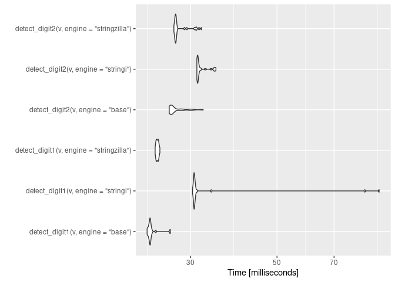
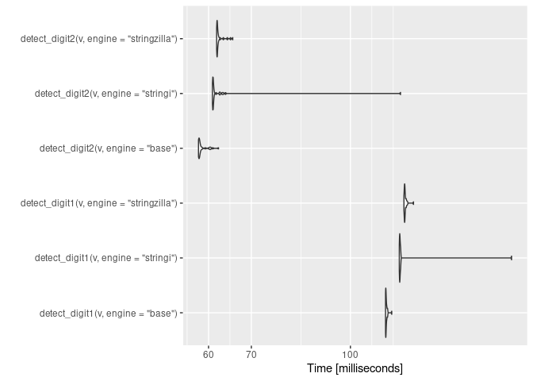
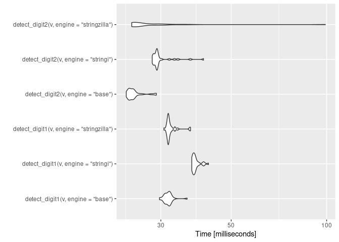
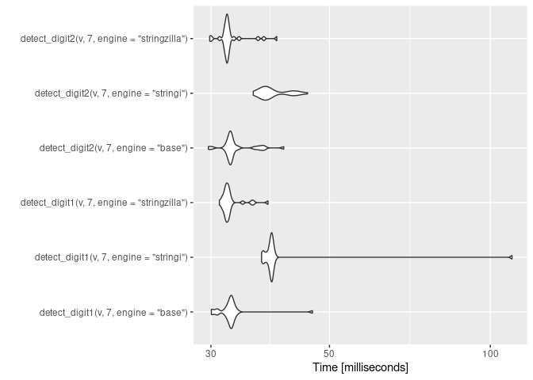

<!-- README.md is generated from README.Rmd. Please edit that file -->

# nabeatsuR

<!-- badges: start -->
<!-- badges: end -->

## これは何？

「3の倍数」または「いずれかの位に3がある数」を判定します。

## パフォーマンス

「3の倍数」または「いずれかの位に3がある数」を判定する関数として、`nabeatsuR::detect_digit1`と`nabeatsuR::detect_digit2`の2つを用意しました。

`detect_digit1`は、ベクトルのすべての要素について「3の倍数」か「いずれかの位に3がある数」かをそれぞれ判定し、2つのlogical
vectorsの論理和をとります。
一方で、`detect_digit2`では、先に3で割った余りを求めてから、剰余が0でなかった要素のみについて「いずれかの位に3がある数」かを判定し、ここで`TRUE`になった位置にある要素を後から`TRUE`に置き換えるという処理をします。

「いずれかの位に3がある数」かを判定する文字列処理には`base::grepl`、`stringi::stri_detect_fixed`と、[ashvardanian/StringZilla](https://github.com/ashvardanian/StringZilla)をラップした`nabeatsuR:::nb_detect_cpp`を使います。

1e+05までの自然数について、これらの関数で「3の倍数」または「いずれかの位に3がある数」の判定をすると、次のようになります。

``` r
require(nabeatsuR)
#>  要求されたパッケージ nabeatsuR をロード中です
require(microbenchmark)
#>  要求されたパッケージ microbenchmark をロード中です
require(ggplot2)
#>  要求されたパッケージ ggplot2 をロード中です

v <- seq_len(10^5)

(three <- microbenchmark(
  detect_digit1(v, engine = "base"),
  detect_digit1(v, engine = "stringi"),
  detect_digit1(v, engine = "stringzilla"),
  detect_digit2(v, engine = "base"),
  detect_digit2(v, engine = "stringi"),
  detect_digit2(v, engine = "stringzilla"),
  times = 30,
  check = "equal"
))
#> Unit: milliseconds
#>                                      expr      min       lq     mean   median
#>         detect_digit1(v, engine = "base") 23.23200 23.50652 23.81875 23.63151
#>      detect_digit1(v, engine = "stringi") 30.37577 30.62339 34.59877 30.67615
#>  detect_digit1(v, engine = "stringzilla") 24.35823 24.51797 24.68482 24.69124
#>         detect_digit2(v, engine = "base") 26.47173 26.71903 27.51093 26.85284
#>      detect_digit2(v, engine = "stringi") 31.16180 31.24171 31.91233 31.35169
#>  detect_digit2(v, engine = "stringzilla") 27.21047 27.41414 28.21720 27.52865
#>        uq      max neval
#>  23.73593 26.63517    30
#>  30.83990 91.31212    30
#>  24.80308 25.05137    30
#>  28.12125 32.34562    30
#>  31.71522 34.86958    30
#>  27.65965 32.00813    30

autoplot(three)
```



`detect_digit2`は一見無駄な処理をしていてパフォーマンスが悪化しているように見えますが、判定する値のなかに桁が長い数がたくさんある（文字列として処理するコストが高くなる）場合に効果的です。

``` r
v <- sample(c(9007199254740994, 9007199254740995), 10^5, replace = TRUE)

(three <- microbenchmark(
  detect_digit1(v, engine = "base"),
  detect_digit1(v, engine = "stringi"),
  detect_digit1(v, engine = "stringzilla"),
  detect_digit2(v, engine = "base"),
  detect_digit2(v, engine = "stringi"),
  detect_digit2(v, engine = "stringzilla"),
  times = 30,
  check = "equal"
))
#> Unit: milliseconds
#>                                      expr       min        lq      mean
#>         detect_digit1(v, engine = "base") 113.47961 113.53181 113.80020
#>      detect_digit1(v, engine = "stringi") 119.24159 119.36655 121.48220
#>  detect_digit1(v, engine = "stringzilla") 121.25198 121.47302 121.84971
#>         detect_digit2(v, engine = "base")  57.87088  57.95117  58.55123
#>      detect_digit2(v, engine = "stringi")  60.85003  60.94279  63.30000
#>  detect_digit2(v, engine = "stringzilla")  61.77489  61.86397  62.28977
#>     median        uq       max neval
#>  113.64614 113.85304 116.04738    30
#>  119.48712 119.65599 178.62225    30
#>  121.61748 121.89826 125.50310    30
#>   58.02378  58.48267  62.20321    30
#>   61.00880  61.18440 119.76163    30
#>   61.91281  62.13190  65.47108    30

autoplot(three)
```



``` r
v <- sample.int(10^8, 10^5, replace = TRUE)

(three <- microbenchmark(
  detect_digit1(v, engine = "base"),
  detect_digit1(v, engine = "stringi"),
  detect_digit1(v, engine = "stringzilla"),
  detect_digit2(v, engine = "base"),
  detect_digit2(v, engine = "stringi"),
  detect_digit2(v, engine = "stringzilla"),
  times = 30,
  check = "equal"
))
#> Unit: milliseconds
#>                                      expr      min       lq     mean   median
#>         detect_digit1(v, engine = "base") 29.70770 30.99222 31.64708 31.65468
#>      detect_digit1(v, engine = "stringi") 37.56383 37.82481 38.65376 38.27532
#>  detect_digit1(v, engine = "stringzilla") 30.67255 31.58676 32.21993 31.70467
#>         detect_digit2(v, engine = "base") 23.33650 23.77097 24.71691 24.37769
#>      detect_digit2(v, engine = "stringi") 28.17076 28.62563 30.04019 29.15300
#>  detect_digit2(v, engine = "stringzilla") 24.28767 24.56542 29.01274 25.17767
#>        uq      max neval
#>  32.08319 36.31114    30
#>  38.80959 42.40518    30
#>  32.12764 37.21332    30
#>  24.73256 29.04502    30
#>  29.34397 40.90589    30
#>  29.16531 99.06428    30

autoplot(three)
```



一方で、`detect_digit2`が効果的なのは「3の倍数」が比較的高い密度で存在しているためであって、たとえば「7の倍数」または「いずれかの位に7がある数」を判定する場合では、`detect_digit1`と大きな差はなくなるようです。

``` r
(seven <- microbenchmark(
  detect_digit1(v, 7, engine = "base"),
  detect_digit1(v, 7, engine = "stringi"),
  detect_digit1(v, 7, engine = "stringzilla"),
  detect_digit2(v, 7, engine = "base"),
  detect_digit2(v, 7, engine = "stringi"),
  detect_digit2(v, 7, engine = "stringzilla"),
  times = 30,
  check = "equal"
))
#> Unit: milliseconds
#>                                         expr      min       lq     mean
#>         detect_digit1(v, 7, engine = "base") 30.04879 32.11704 32.79071
#>      detect_digit1(v, 7, engine = "stringi") 37.31038 38.40845 41.05230
#>  detect_digit1(v, 7, engine = "stringzilla") 31.10582 31.90812 32.61777
#>         detect_digit2(v, 7, engine = "base") 29.66097 32.45462 33.48197
#>      detect_digit2(v, 7, engine = "stringi") 36.00516 37.85155 39.21404
#>  detect_digit2(v, 7, engine = "stringzilla") 29.83681 31.91169 32.64217
#>    median       uq       max neval
#>  32.62673 32.92895  46.45731    30
#>  38.90129 39.11223 109.81011    30
#>  32.12731 32.47868  38.35666    30
#>  32.70258 33.42672  41.06136    30
#>  38.13658 42.31024  45.48886    30
#>  32.12817 32.37962  39.84171    30

autoplot(seven)
```



## 文字列検索はどれが速いのか

正規表現を使わない場合、`base::grep`や`base::grepl`が速いようです。ASCII文字を検索する場合、ヒューリスティクスが有効にはたらくとStringZillaのラッパーも速いようですが、手もとの環境でふつうに使うかぎりではstringrのほうが速いようでした。

``` r
v <- text2vec::movie_review |>
  tidytext::unnest_tokens(token, review) |>
  dplyr::pull(token) |>
  sample(10^5, replace = TRUE)

microbenchmark(
  grepl("movie", v, fixed = TRUE),
  stringr::str_detect(v, stringr::fixed("movie")),
  nabeatsuR::strzl_detect(v, "movie"),
  times = 30,
  check = "equal"
)
#> Unit: milliseconds
#>                                             expr      min       lq     mean
#>                  grepl("movie", v, fixed = TRUE) 1.633491 1.641041 1.679837
#>  stringr::str_detect(v, stringr::fixed("movie")) 3.769172 3.830592 3.934378
#>              nabeatsuR::strzl_detect(v, "movie") 7.777788 7.892532 8.446546
#>    median       uq       max neval
#>  1.654663 1.699045  1.859998    30
#>  3.892820 3.951477  4.651213    30
#>  8.262600 8.749467 11.512068    30
```

``` r
v <- c(letters, LETTERS, as.character(0:9)) |>
  sample(500 * 10^5, replace = TRUE) |>
  vctrs::vec_chop(sizes = rep_len(500, 10^5)) |>
  purrr::map_chr(~ paste0(., collapse = ""))

microbenchmark(
  grep("aaa", v, value = FALSE, fixed = TRUE),
  stringr::str_which(v, stringr::fixed("aaa")),
  nabeatsuR::strzl_which(v, "aaa"),
  times = 30,
  check = "equal"
)
#> Unit: milliseconds
#>                                          expr      min       lq     mean
#>   grep("aaa", v, value = FALSE, fixed = TRUE) 12.67777 12.73290 12.84367
#>  stringr::str_which(v, stringr::fixed("aaa")) 19.99421 20.08692 20.16943
#>              nabeatsuR::strzl_which(v, "aaa") 71.81289 72.23291 72.70651
#>    median       uq      max neval
#>  12.81479 12.88625 13.55730    30
#>  20.14643 20.25286 20.47361    30
#>  72.66298 72.95864 76.82774    30
```
